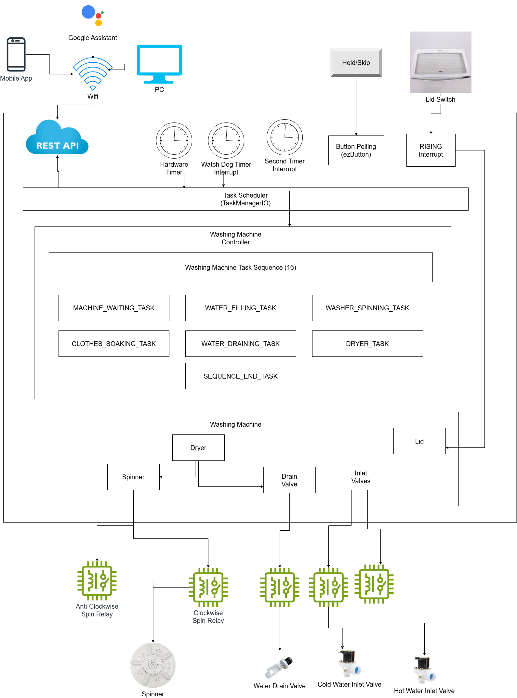

 

  <h1>Smart Washing Machine Controller ESP8266</h1>
  
<h3 align="center">Firmware for ESP8266 Controller 🚀</h3>

[Hardware Design](https://github.com/HuzaifaIrfan-CAD/smart_washing_machine)
&nbsp;&nbsp;•&nbsp;&nbsp;
[Android App](https://github.com/HuzaifaIrfan-Mobile/smart_washing_machine_app)

## Features
- [x] CPU Task Scheduler (Task Manager IO) for Running CPU Tasks
- [x] 16x Machine Tasks can be set in the Tasks Sequence
- [x] REST API Server for Remote Control
- [x] Watch Dog Timer to Restart if the CPU is out of Control
- [x] Rising Interrupt (if Lid is Opened) and Pause if Drying
- [ ] Water Level Sensor
- [ ] Maximum Water Inlet Motor Time
- [ ] Minimum Time to Drain Water before New Filling and Spinning
- [ ] Water Level Switch to be added Later

## REST API Server (Postman Documentation)
https://documenter.getpostman.com/view/6684754/2s9YXmWfAG

## Install
- VS Code
- PlatfornIO

## Flash to ESP8266 Controller
- Change Your WIFI SSID and Password in [rest_api_server](smart_washing_machine_esp8266/src/rest_api_server/rest_api_server.cpp)

## Overview

### Washing Machine Tasks

| ID | Description             | Minimum (s) | Countdown (s) | Maximum (s) |
|----|-------------------------|-------------|----------------|--------------|
| 0  | MACHINE_WAITING_TASK    | 1           | 5              | 60           |
| 1  | WATER_FILLING_TASK      | 30          | 60             | 1200         |
| 2  | WASHER_SPINNING_TASK    | 30          | 300            | 600          |
| 3  | CLOTHES_SOAKING_TASK    | 60          | 300            | 1800         |
| 4  | WATER_DRAINING_TASK     | 120         | 120            | 1200         |
| 5  | DRYER_TASK              | 60          | 120            | 300          |
| 6  | SEQUENCE_END_TASK       | 20          | 20             | 30           |

### Lid Switch Truth Table

| Lid Closed | Dryer Vibration Safety Switch (NC) | Line Connected | Pulled Up Pin | Code Check     |
|------------|-------------------------------------|----------------|----------------|----------------|
| 0          | 0                                   | 0              | 5V             | digitalRead    |
| 1          | 0                                   | 0              | 5V             | RISING Interrupt |
| 0          | 1                                   | 0              | 5V             | digitalRead    |
| 1          | 1                                   | 1              | GND            | digitalRead    |

- NC = Normally Closed

## 🤝🏻 &nbsp;Connect with Me

## License

Licensed under the MIT License, Copyright 2023 Huzaifa Irfan. [LICENSE](LICENSE)